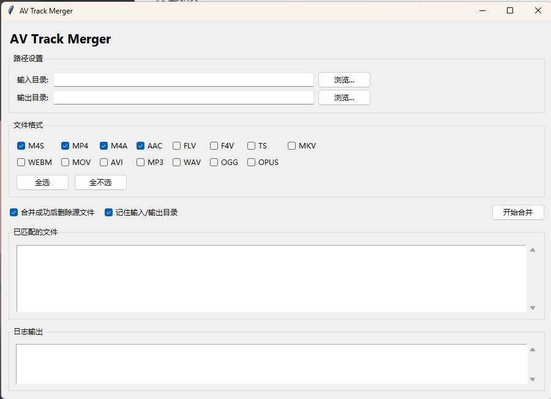

# AV Track Merger

<div align="center">


**把分离的音频/视频文件自动配对合并为 MP4**

</div>

---

## 适用场景

- B 站、抖音等平台下载后音视频分离
- 同目录内存在多组音视频文件，需要批量合并

## 主要功能

- 图形界面操作，先选格式再选目录
- 自动识别音轨/视频轨，优先同名匹配
- 合并成功后可自动删除源文件
- 一键打包为 EXE

## 界面预览



## 支持格式

可合并以下常见分离音视频格式（按需勾选）：
`m4s`、`mp4`、`m4a`、`aac`、`flv`、`ts`、`mkv`、`webm`、`mov`、`avi`、`mp3`、`wav`、`ogg`、`opus`。

## 使用方式

推荐双击 `av-track-merger.vbs`（无 CMD 窗口），操作流程：
1. 勾选需要的文件格式
2. 点击“浏览...”并挑选任意目标文件（可多选，用于定位目录）
3. 选择输出目录
4. 点击“开始合并”

勾选“记住输入/输出目录”后，下次启动会自动填充上次目录。  
界面中会显示“已匹配的文件”，用于确认目录内有哪些文件会被处理。

输出文件命名格式：`序号.ATM_YYYY_MM_DD_HH.MM.mp4`（每次运行从 1 开始）。

提示：仓库默认不包含 FFmpeg。直接运行脚本时，请把 FFmpeg 解压到 `ffmpeg/bin`。

## 打包 EXE

安装 PyInstaller 后执行：

```bash
av-track-merger-打包.bat
```

生成：

```
dist\av-track-merger.exe
```

打包完成后会自动清理 `build/`、`__pycache__/` 和临时 spec 文件。  
打包时需要本地存在 `ffmpeg/bin/ffmpeg.exe` 和 `ffmpeg/bin/ffprobe.exe`。

FFmpeg 下载地址：https://ffmpeg.org/download.html  
教程：下载后解压，将整个 `ffmpeg` 文件夹放到本项目下（包含 `bin` 目录）。

## 目录结构

```
bilibili-m4s-merger/
├── app.py
├── av-track-merger.vbs
├── av-track-merger-打包.bat
├── icon.png
└── README.md
```

## License

MIT
