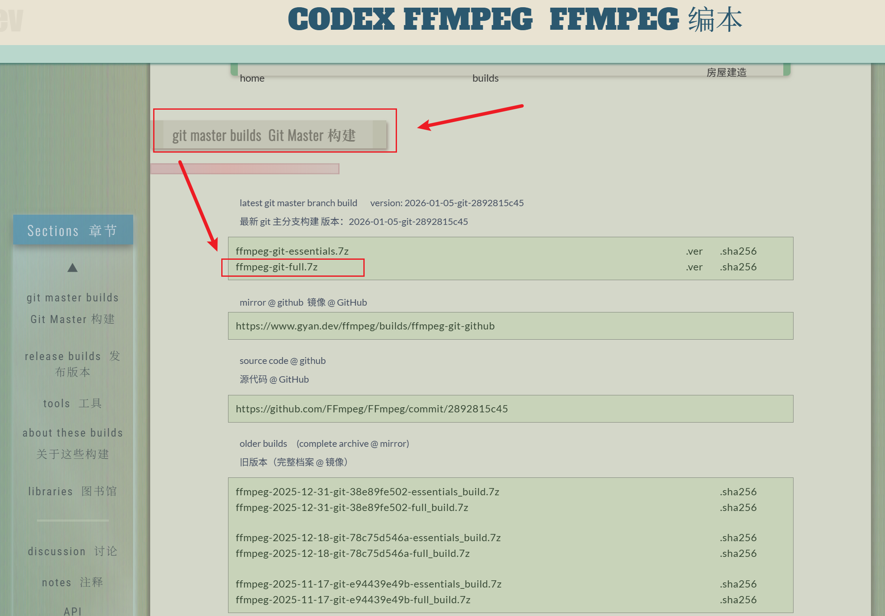
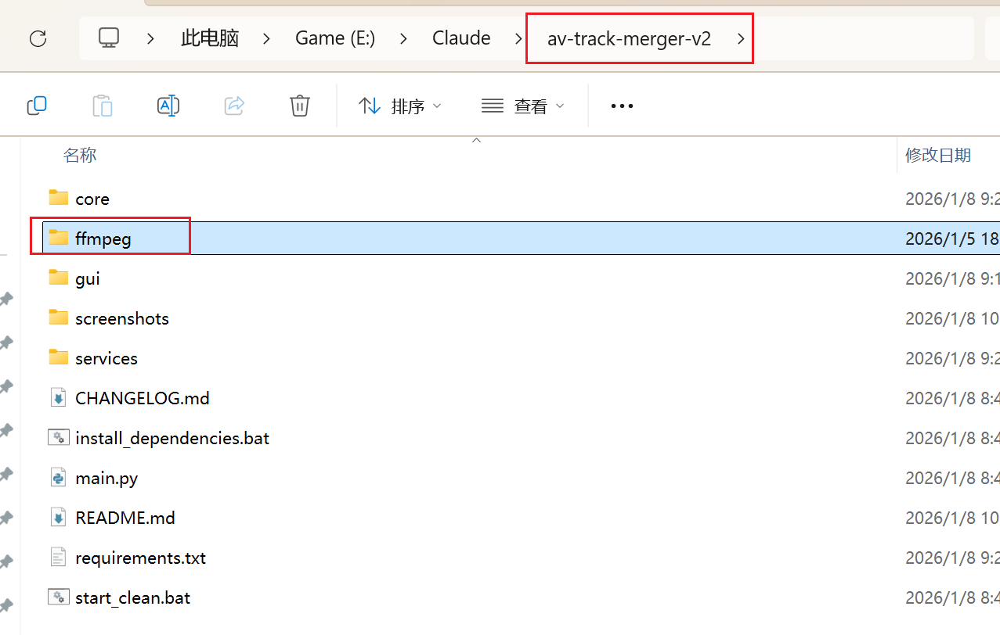
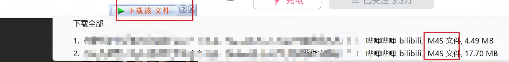
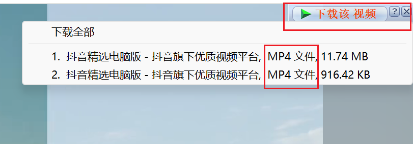
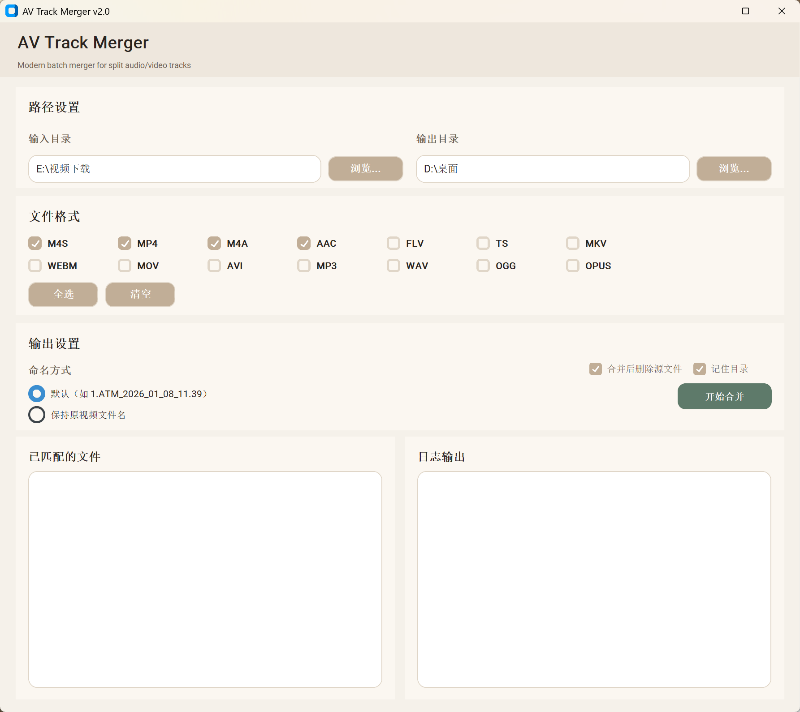
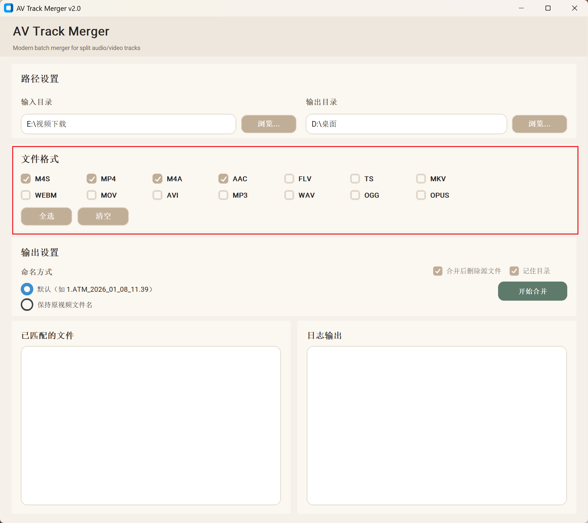
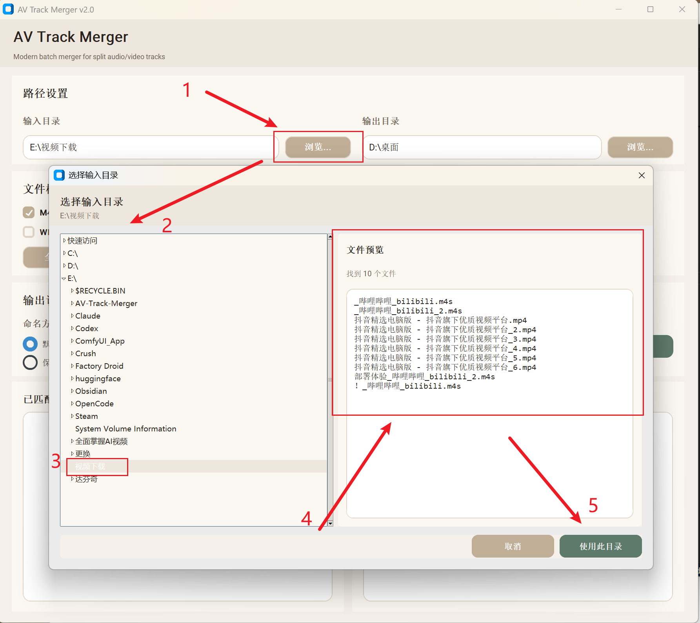
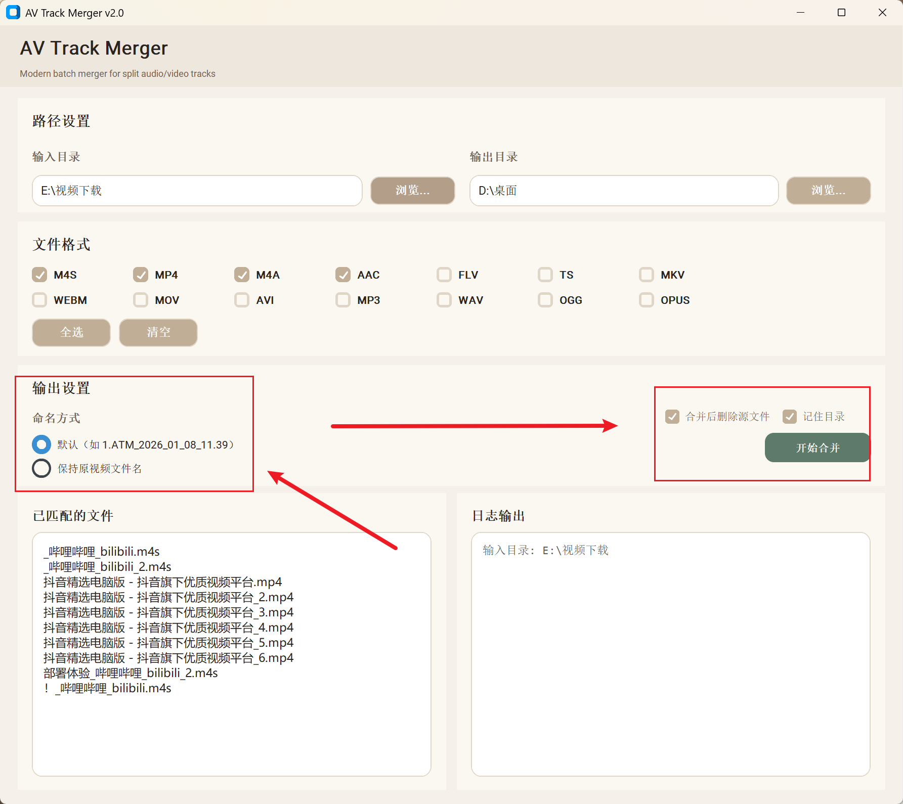
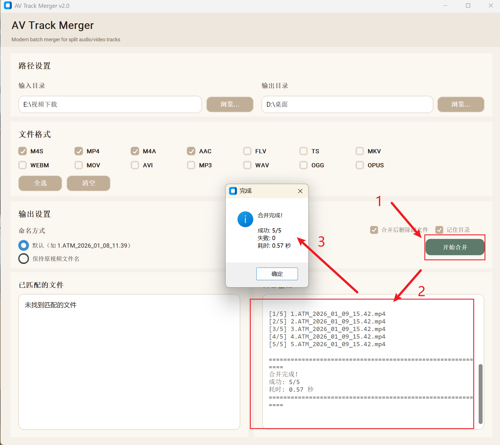
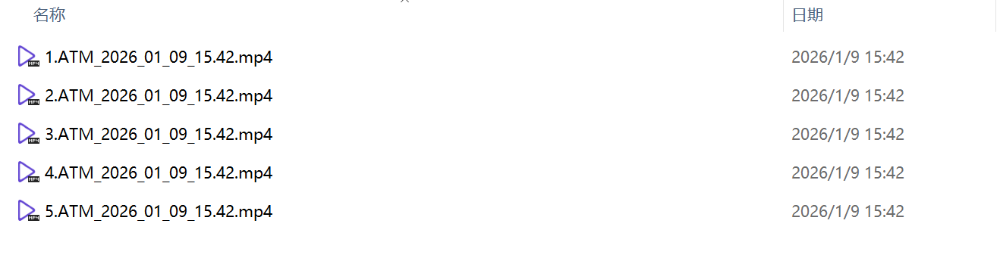

# AV Track Merger 

音视频分离文件批量合并工具（CustomTkinter + FFmpeg）。

---

## 功能特点

- 按时长匹配分离的音视频文件
- 批量处理文件夹内的分离媒体
- 自定义浏览器（目录树 + 文件预览）
- 记住目录、合并后删除源文件等选项

---

### 方式一：Releases 直接运行（推荐）

1) 打开 Releases 下载 `AV Track Merger.exe`
https://github.com/Yifo98/AV-Track-Merger/releases/tag/v1.0.1
2) 直接运行即可（已包含依赖与 FFmpeg）

### 方式二：源码运行（venv）

1) 获取源码
```
git clone https://github.com/Yifo98/AV-Track-Merger.git
```

2) 安装 Python 3.8+
   - https://www.python.org/downloads/
   - 安装时勾选“Add Python to PATH”

3) 下载 FFmpeg
   - https://www.gyan.dev/ffmpeg/builds/
   - 

4) 解压并准备 FFmpeg
   - 将 `ffmpeg/bin` 放到项目根目录 `ffmpeg` 下
   - 或将 FFmpeg 添加到系统 PATH
   - 

5) 一键安装依赖
```
install_dependencies.bat
```

6) 启动
```
run.bat
```

---

## 打包为独立 EXE（PyInstaller）

1) 确保项目根目录内存在 `ffmpeg` 目录
2) 一键打包
```
build_exe.bat
```
3) 输出文件
- `X:\XXX\dist\AV Track Merger.exe`

### 发布说明（Release 准备）

- 打包脚本：`build_exe.bat`（已移除 PyInstaller `--splash`）
- 启动画面：程序内置自定义启动窗（可拖动），图片来自 `assets/splash.png`
- 依赖：`requirements.txt` + 项目根目录的 `ffmpeg` 文件夹
- 发布产物：`dist/AV Track Merger.exe`

---

## 使用步骤

1) 点击“浏览...”选择输入目录
2) 选择输出目录
3) 勾选需要处理的文件格式
4) 选择命名方式，按需勾选删除源文件/记住目录
5) 点击“开始合并”

---

## IDM 下载文件教程（带截图）

> 以 B 站/抖音等平台为例，IDM 通常会下载出“视频文件 + 音频文件”两份。

1) IDM 下载后会出现两个文件（无声视频 + 音频）
- 
- 

2) 统一添加到队列一次性下载
- 

---

## 使用截图

- 主界面：
- 文件格式：
- 浏览界面：
- 输出设置：
- 合并输出：
- 输出文件：

---

## 配置说明

配置文件：`settings.json`

常用配置项：
- `max_duration_diff`：最大时长差异（秒）
- `delete_sources`：合并成功后删除源文件
- `remember_dirs`：记住上次使用目录
- `last_input_dir`：上次输入目录
- `last_output_dir`：上次输出目录
- `parallel_workers`：并行分析线程数

---
## 目录结构与作用

- `assets/`：应用图标、启动加载图
- `core/`：合并流程和匹配等核心逻辑
- `gui/`：界面布局与交互
- `services/`：FFmpeg 服务、配置管理等辅助层
- `screenshots/`：README 使用截图
- `settings.json`：保存默认参数、记住目录等配置
- `build_exe.bat`：一键打包 EXE（仅维护者使用）
- `install_dependencies.bat`：创建 venv 并安装依赖
- `run.bat`：使用 venv 启动程序
- `main.py`：程序入口


---

## 常见问题

**Q1: 找不到可匹配的文件**
- 确保目录内同时存在视频与音频文件
- 时长差异过大也会导致匹配失败

**Q2: 合并后无声音**
- 音频文件可能损坏或缺失
- FFmpeg 版本过旧时建议更换

**Q3: 程序无法启动**
- Python 版本 >= 3.8
- 运行 `install_dependencies.bat` 安装依赖

---


---

## 许可

Yifo
